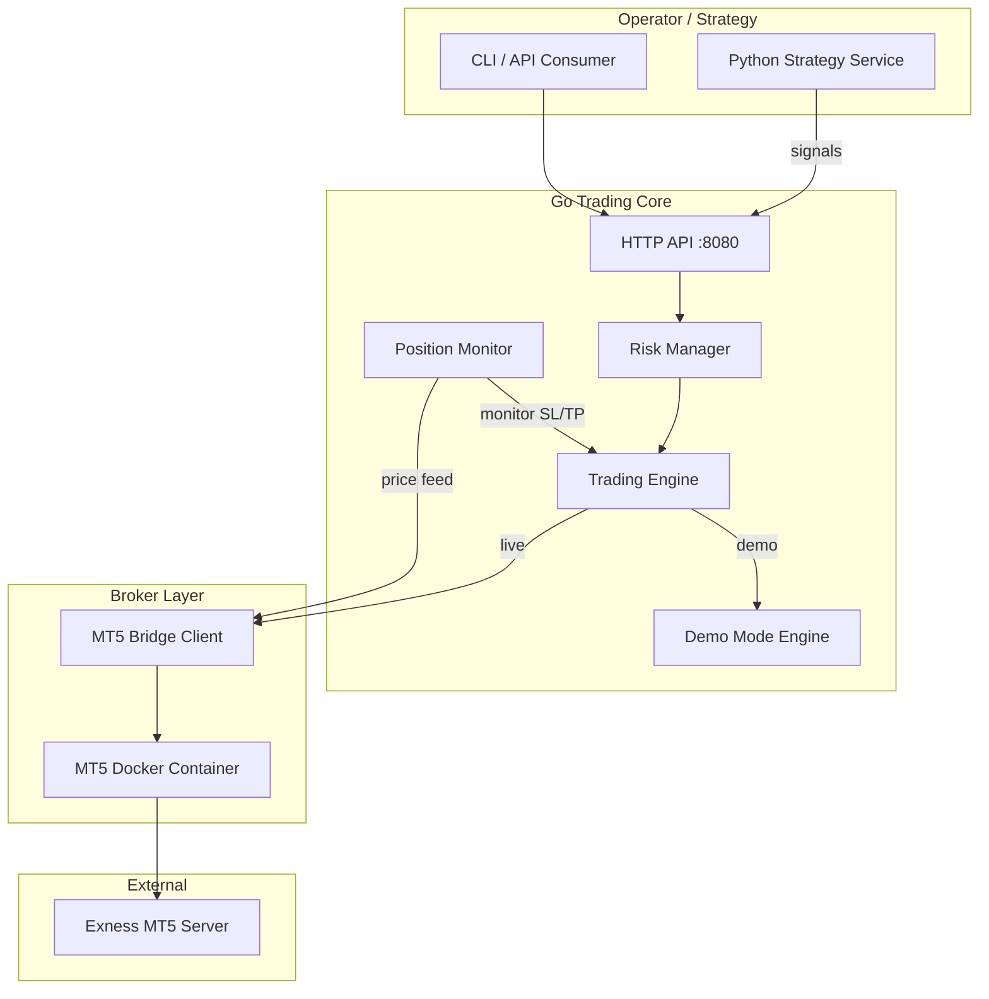
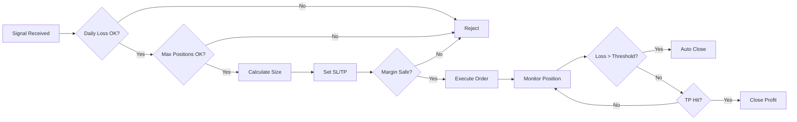

# System Architecture

## High-Level Diagram



## Component Responsibilities

### Go Trading Core (`backend/`)

| Package | Responsibility |
|---------|----------------|
| `cmd/trader` | Entry point, wiring, graceful shutdown |
| `internal/config` | YAML config loading |
| `internal/api` | REST API for orders, positions, health |
| `internal/risk` | Pre-trade validation, auto-exit logic |
| `internal/trading` | Order lifecycle, position tracking |
| `internal/broker` | MT5 bridge HTTP client (stub until credentials) |
| `internal/demo` | Simulated market fills for Phase 1 |
| `internal/monitor` | Background position watcher |

### Python Strategy (`strategy/`)

| Component | Responsibility |
|-----------|----------------|
| `train.py` | Model training pipeline (placeholder) |
| `signals.py` | Generate buy/sell/hold signals |
| `backtest.py` | Historical strategy evaluation (future) |

Communicates with Go core via HTTP API.

### MT5 Bridge (Docker, Phase 1.5)

Third-party or self-hosted container running MT5 under Wine with REST API. Not started until credentials are provided.

## Data Flow: Open Trade

```
1. Strategy POST /api/v1/signals {symbol, action, confidence}
2. API → RiskManager.ValidateSignal()
   ├─ Check daily loss limit
   ├─ Check max open positions
   ├─ Calculate position size from risk budget
   ├─ Compute SL/TP levels (10% TP target, max loss SL)
   └─ Return approved OrderRequest or rejection
3. TradingEngine.Execute()
   ├─ Demo mode: DemoEngine simulates fill at bid/ask + spread
   └─ Live mode: BrokerClient → MT5 bridge → Exness
4. PositionMonitor tracks open position every N ms
   ├─ Update unrealized P&L
   ├─ Check auto-exit conditions
   └─ Trigger close if thresholds breached
5. On close: log trade, update daily P&L, notify strategy
```

## Risk Management Flow



## Configuration

All settings in `config/config.yaml` (from `config.example.yaml`):

- `mode`: `demo` | `live`
- `risk.profit_target_pct`: default 10.0
- `risk.max_loss_pct`: default 2.0 (of equity per trade)
- `risk.daily_loss_limit_pct`: default 5.0
- `risk.max_open_positions`: default 3
- `broker.mt5_bridge_url`: MT5 REST bridge endpoint
- `broker.account_id`: set after account registration

## Deployment Topology

```
┌─────────────────────────────────────────────┐
│ Docker Host (Linux)                         │
│                                             │
│  ┌─────────────┐  ┌─────────────┐           │
│  │ trader      │  │ mt5-bridge  │           │
│  │ (Go binary) │──│ (Wine+MT5)  │           │
│  │ :8080       │  │ :8000       │           │
│  └─────────────┘  └─────────────┘           │
│                                             │
│  ┌─────────────┐                            │
│  │ strategy    │  (optional, Phase 2)       │
│  │ (Python)    │                            │
│  └─────────────┘                            │
└─────────────────────────────────────────────┘
```

## Phase Roadmap

| Phase | Scope | Status |
|-------|-------|--------|
| 1a | Docs + Go scaffold + demo mode | **Done** |
| 1b | MT5 bridge integration | Waiting for credentials |
| 2a | Demo account trading, data collection | Planned |
| 2b | Backtesting framework | Planned |
| 2c | Model training + paper trading | Planned |
| 3 | Live trading with strict limits | Future |

## Security

- Credentials stored in `config/credentials.yaml` (gitignored)
- MT5 bridge uses bearer token auth
- No credentials in code or committed config
- Live mode requires explicit config flag + confirmation
- The trading API itself requires `server.api_token` as a
  `Authorization: Bearer <token>` header on every route except `/health`
  (set in `config/config.yaml`; the server logs a loud warning at startup if
  it's unset). Binds to `127.0.0.1` by default — set `server.host`
  explicitly to expose it beyond localhost, and always set a token if you do.

## Trading Control Gate

A single, persisted, global switch gates every order-placing path (Go
`PlaceOrder`/`ProcessSignal`, the Python mirror in
`strategy/exness_executor.py`) — trading starts **disabled** on a fresh state
file and stays that way until explicitly enabled. State is persisted to
`data/trading_state.json` (path configurable via `control.state_path`) so a
restart never silently re-enables trading.

```
GET  /api/v1/control/status     — {enabled, reason, changed_at, changed_by}
POST /api/v1/control/enable     — {reason?, by?}
POST /api/v1/control/disable    — {reason?, by?}
POST /api/v1/control/stop-all   — disable + best-effort close every open position
```

This gate does not reach the alternate execution paths (`exness_web_bot.py
--loop`, the MT5 Expert Advisor) — see `docs/NO_API_OPTIONS.md` for how to
stop those manually.

## API Endpoints (Phase 1)

```
GET  /health                    — service health (no auth)
GET  /api/v1/account            — account summary
GET  /api/v1/positions          — open positions
GET  /api/v1/orders             — pending orders
POST /api/v1/orders             — place order (through risk engine + control gate)
DELETE /api/v1/positions/{id}   — close position
POST /api/v1/signals            — strategy signal intake (through control gate)
GET  /api/v1/risk/status        — risk engine state
POST /api/v1/risk/reset         — reset daily P&L (demo mode only)
GET  /api/v1/control/status     — trading control gate state
POST /api/v1/control/enable     — enable trading
POST /api/v1/control/disable    — disable trading
POST /api/v1/control/stop-all   — disable + close all positions
```
