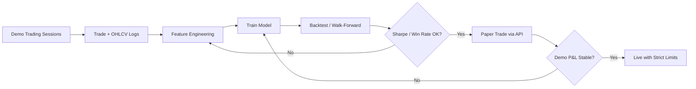

# ML Strategy Pipeline Plan

How to collect demo trade data, train/evaluate a model, and paper-trade before live deployment.

## Overview



## Phase 2a: Data Collection

### What to collect

| Data | Source | Format |
|------|--------|--------|
| OHLCV bars | MT5 bridge / broker API | CSV per symbol/timeframe |
| Trade log | Go API `/api/v1/orders`, closed trades | JSON/CSV |
| Account snapshots | Go API `/api/v1/account` | JSON |
| Spread & slippage | Quote feed at entry/exit | CSV |

### Collection workflow

1. Run Go trader in **demo mode** with MT5 bridge connected to Exness demo account
2. Execute manual or rule-based signals for 2–4 weeks minimum
3. Export snapshots: `python strategy/collect_data.py --output data/demo_snapshot.json`
4. Pull historical bars from MT5 (Python `MetaTrader5` library or bridge API)
5. Store in `data/` (gitignored)

### Minimum dataset size

- **500+ labeled trades** before trusting any model
- **6+ months OHLCV** for backtesting across regimes (trend, range, volatile)
- Include losing trades — models trained only on winners overfit

## Phase 2b: Feature Engineering

Example features for a direction classifier (buy/sell/hold):

```
- Returns: 1h, 4h, 24h log returns
- Volatility: ATR(14), rolling std of returns
- Trend: SMA crossover distance, RSI(14)
- Microstructure: current spread / avg spread
- Time: hour of day, day of week (forex session effects)
- Position context: open positions count, daily P&L
```

Label definition options:

| Label | Definition | Pros | Cons |
|-------|------------|------|------|
| Forward return | Sign of price change N bars ahead | Simple | Noisy |
| Risk-adjusted | Hit TP before SL within N bars | Aligns with strategy | Requires simulation |
| Actual outcome | Realized P&L of demo trades | Ground truth | Limited samples early |

**Recommended:** Start with forward-return labels for exploration; switch to TP/SL simulation labels once enough demo trades exist.

## Phase 2c: Model Training

### Starting models (keep it simple)

1. **Baseline:** Random forest or gradient boosting (XGBoost/LightGBM) on tabular features
2. **Evaluation:** Walk-forward validation — never shuffle time series
3. **Metrics:**
   - Classification: precision/recall per class, especially on "hold"
   - Trading: Sharpe ratio, max drawdown, win rate, profit factor
   - Risk: % trades hitting SL vs TP

### Training script

```bash
cd strategy
python train.py --data ../data/features.csv --output models/strategy.pkl
```

Current `train.py` is a placeholder — implement after data collection.

### Anti-overfitting rules

- Walk-forward splits only (train on past, test on future)
- Penalize models that trade too frequently (transaction costs)
- Require minimum confidence threshold before sending signals
- Compare always against a simple baseline (e.g. SMA crossover)

## Phase 2d: Paper Trading

Before live:

1. Deploy trained model as a cron/loop calling `signals.py`
2. Model outputs buy/sell/hold → POST to Go `/api/v1/signals`
3. Go risk manager validates every signal (10% TP target, SL, daily limits)
4. Run on **Exness demo account** via MT5 bridge for 4+ weeks
5. Compare paper P&L to backtest expectations

### Signal flow

```
Model inference (Python)
    → POST /api/v1/signals {action, confidence}
    → Go RiskManager.ValidateSignal()
    → TradingEngine.Execute() [demo or MT5]
    → PositionMonitor (SL/TP/auto-exit)
    → Log outcome → feed back to training data
```

### Confidence gating

Only send signals when `confidence >= threshold` (e.g. 0.65). Tune threshold on validation set to balance trade frequency vs accuracy.

## Phase 3: Live Deployment (Future)

Prerequisites:

- [ ] 4+ weeks profitable demo/paper trading
- [ ] Max drawdown within risk limits in demo
- [ ] Model performance stable across recent weeks
- [ ] MT5 bridge tested with real Exness demo then micro live lot sizes
- [ ] Explicit `mode: live` in config with user confirmation

Live safeguards (already in Go core):

- 2% max loss per trade (equity-based SL)
- 5% daily loss limit
- 3 max open positions
- Emergency close at 100% margin level
- Auto-exit at 5% unrealized loss on margin

## Browser Automation vs MT5

| Approach | Latency | Reliability | Recommended |
|----------|---------|-------------|-------------|
| MT5 REST bridge | 50–200ms | High | **Primary** |
| MetaTrader5 Python | 50–200ms | High | Alternative |
| Browser automation | 500ms–2s | Low (UI changes) | Fallback only |

Browser automation (`POST /api/v1/broker/browser/enable`) is a placeholder for when the user logs into Exness web terminal. Use MT5 bridge for production automation.

## Directory Layout

```
strategy/
  signals.py          — send signals to Go API
  train.py            — model training (placeholder)
  collect_data.py     — export API snapshots
  requirements.txt
data/                 — gitignored training data
models/               — gitignored trained models
```

## Honest Expectations

- **10% profit per trade is aggressive** — most professional systems target 1–3% monthly, not per trade
- ML models cannot guarantee profit; markets are non-stationary
- Demo fills ≠ live fills (slippage, requotes, gaps)
- Retrain periodically as market regimes shift
- Start with smallest lot size (0.01) on live
